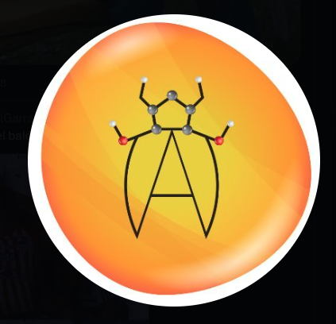

  

---

🔬 In the **Bilodeau Group**, we explore the intersection between **molecular simulations**, **statistical physics**, and **artificial intelligence** to develop tools for discovering and designing new molecules, surfaces, and proteins with optimized properties.  

Our core expertise lies in:  
- **Molecular dynamics simulations** of soft matter systems  
- **Artificial intelligence** for molecular property prediction and generation  

This interdisciplinary toolset allows us to address important challenges in applications such as:  
- Designing **biotherapeutics**  
- Developing **novel separation materials**  

---

### 👩‍🔬 [Camille Bilodeau](https://engineering.virginia.edu/faculty/camille-bilodeau)
  

---

### 🌐 Website  
  

---

### 🛠️ Languages and Tools  

  
  
  
  
  
  

  

---

### 📊 GitHub Stats  

